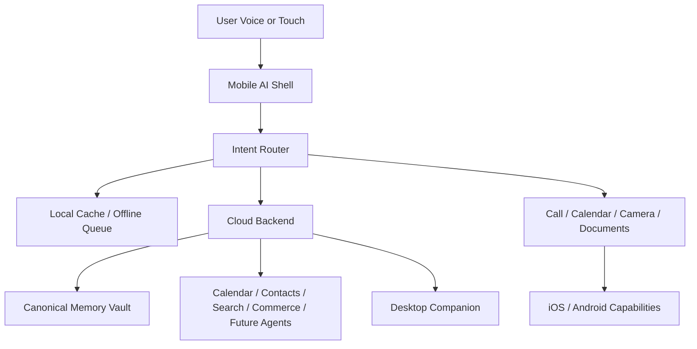

# Smartphone-First Architecture

## Goal

Build a smartphone app that acts like a personal AI operating layer, not a traditional multi-app experience.

The smartphone version is the prototype bridge between today’s phones and the future dedicated thin-client assistant.

## System Layers

1. Mobile App
   - primary user surface
   - voice + touch interface
   - contacts, calling, calendar, camera, document intake
   - local cache, offline queue, encrypted memory snapshot
2. Cloud Backend
   - canonical memory and profile
   - strong-model inference
   - sync coordinator
   - action routing and future agent gateway
3. Desktop App
   - secondary access point to the same AI and memory graph
4. Shared Contracts
   - common data models for memory, conversations, contacts, uploads, tasks, and agent workflows

## Mobile-First Replacements For Edge Hardware

Instead of custom hardware control:

- phone calls use OS dialer and contacts permissions
- calendar uses native calendar/event permissions
- camera uses native camera and photo library access
- notifications replace some always-on background interaction
- local encrypted storage replaces custom device filesystem assumptions
- mobile-friendly offline intelligence replaces full edge-device inference expectations

## Interaction Model

The user interacts through one adaptive shell:

- a large microphone action
- a simple text input
- big suggested actions
- contextual cards
- short confirmations for risky actions

The AI decides which capability to invoke:

- `call`
- `calendar`
- `camera`
- `documents`
- `memory`
- `assist`

## Agent-Ready Design

The architecture intentionally reserves room for:

- person-to-person assistant coordination
- service-agent integration
- delegated workflows
- confirmation policies and trust levels

Core future layers:

1. Intent Router
2. Capability Graph
3. Action Executor
4. Agent Gateway
5. Trust and Approval Policy
6. Long-running Task State

## High-Level Flow

## Practical MVP Strategy

- Cloud-first by default
- Minimal local fallback at first:
  - cached memory
  - queued actions
  - offline notes
  - limited offline summaries if feasible
- Stronger local models can be added later per platform
