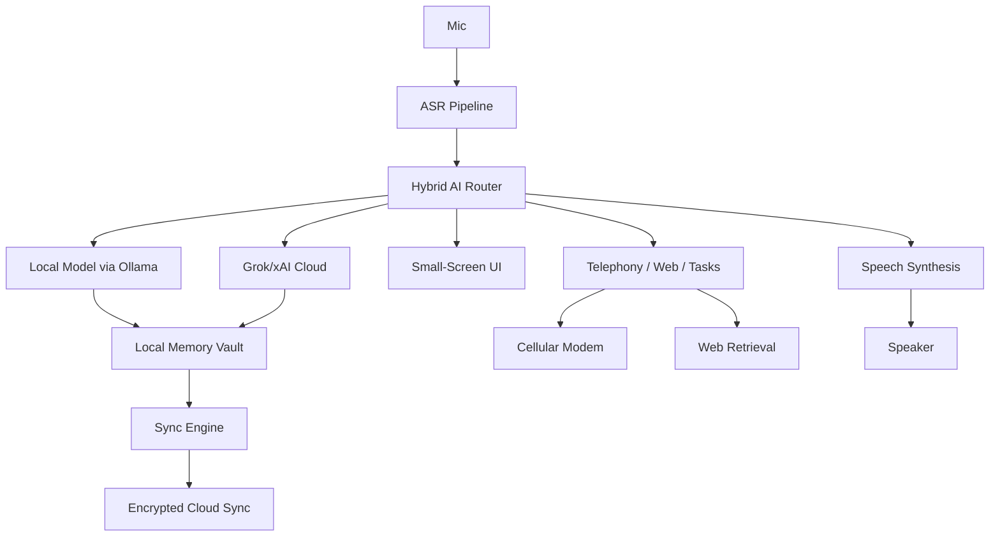

# System Architecture

## Product Goal

Deliver an ultra-thin AI edge companion that behaves as a cloud-first AI communicator when connected, but remains useful offline for telephony, voice notes, summaries, personal memory lookup, and compact local reasoning.

## Functional Blocks

1. Compute
   - Raspberry Pi CM4 or Pi 5-lite carrier
   - Linux host for UI, local inference, sync, telephony, and sensors
2. Cellular
   - Quectel EC25 or RM520N-GL over USB 2.0/PCIe + UART control
   - Voice call support through ALSA/Pulse routing and modem voice path
3. Display + Touch
   - 2.8" to 3.2" portrait display
   - Capacitive touch controller on I2C
4. Audio
   - I2S MEMS microphone
   - I2S DAC / codec or USB audio codec
   - 8 ohm speaker via class-D amplifier
5. Power
   - Single-cell LiPo charger
   - PMIC with system rail control
   - Fuel gauge + solar input front end
6. Local AI
   - Ollama with quantized Phi-3.5-mini / Gemma 2B
   - Chroma or LanceDB for memory embeddings
7. Cloud AI
   - xAI Grok API for high-complexity responses, web search, and agent workflows

## High-Level Data Flow

## Design Constraints

- Thickness target: 6-8 mm assembled
- Low idle power while maintaining instant voice activation
- Safe thermal envelope during modem + inference bursts
- Display readability outdoors
- Reliable voice path for regular phone calls

## Suggested Mechanical Stack

Top to bottom:

1. Cover lens
2. OLED or e-paper module
3. Thin main PCB with castellated or board-to-board modem connection
4. Battery pouch under lower body region
5. Speaker cavity and antenna keep-out zones near top/bottom edges

## Manufacturing Recommendation

- EVT: CM4-based carrier + EC25 LTE first
- DVT: custom thin compute board with CM4/CM5-compatible connector strategy
- PVT: swap to integrated modem design only after carrier and RF validation
